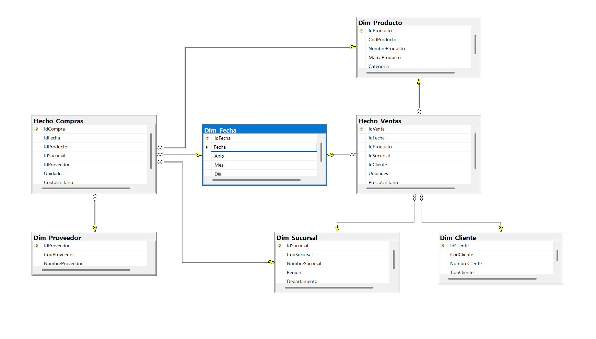

# MODELO MULTIDIMENSIONAL PARA SG-FOOD


SG-FOOD es una empresa que gestiona la compra, distribución y comercialización de productos alimenticios a través de varias sucursales en el país. Con el objetivo de mejorar el análisis de información y la toma de decisiones, se desarrolló un proceso ETL y un modelo de datos para análisis OLAP sobre ventas y compras.

---

## 1. CONCEPTOS BÁSICOS

- **OLAP (Online Analytical Processing):** Técnica que permite explorar y analizar grandes volúmenes de datos desde múltiples perspectivas (dimensiones).
- **Dimensiones:** Ejes de análisis como tiempo, producto, sucursal, cliente, proveedor.
- **Medidas:** Variables numéricas a analizar, como unidades vendidas, costos, ingresos.
- **Jerarquías:** Niveles de agregación dentro de una dimensión (por ejemplo, Año > Mes > Día).

---

## 2. PROCESO ETL

1. **Extracción:** Se recopilaron datos de compras y ventas desde archivos proporcionados por las sucursales.
2. **Transformación:** Se normalizaron formatos, eliminaron duplicados y se homologaron las columnas para integrarlas.
3. **Carga:** Los datos limpios fueron cargados al modelo multidimensional en SQL Server (u otro motor compatible).

---

## 3. DISEÑO DE MODELO MULTIDIMENSIONAL

Se eligió un **modelo constelacion** por su simplicidad y eficiencia en consultas OLAP.

### Diseño representado en diagrama



### Modelo SQL

```
-- ============================
-- Limpieza previa de tablas
-- ============================
IF OBJECT_ID('dbo.Hecho_Compras')  IS NOT NULL DROP TABLE dbo.Hecho_Compras;
IF OBJECT_ID('dbo.Hecho_Ventas')   IS NOT NULL DROP TABLE dbo.Hecho_Ventas;

IF OBJECT_ID('dbo.Dim_Proveedor')  IS NOT NULL DROP TABLE dbo.Dim_Proveedor;
IF OBJECT_ID('dbo.Dim_Cliente')    IS NOT NULL DROP TABLE dbo.Dim_Cliente;
IF OBJECT_ID('dbo.Dim_Sucursal')   IS NOT NULL DROP TABLE dbo.Dim_Sucursal;
IF OBJECT_ID('dbo.Dim_Producto')   IS NOT NULL DROP TABLE dbo.Dim_Producto;
IF OBJECT_ID('dbo.Dim_Fecha')      IS NOT NULL DROP TABLE dbo.Dim_Fecha;

-- ============================
-- Dimensión Fecha
-- ============================
CREATE TABLE dbo.Dim_Fecha (
    IdFecha INT IDENTITY(1,1) PRIMARY KEY,      -- AAAAMMDD
    Fecha   DATE       NOT NULL,
    Anio    INT        NOT NULL,
    Mes     INT        NOT NULL,
    Dia     INT        NOT NULL
);

-- ============================
-- Dimensión Producto
-- ============================
CREATE TABLE dbo.Dim_Producto (
    IdProducto      INT IDENTITY(1,1) PRIMARY KEY,
    CodProducto     VARCHAR(50)  NOT NULL,
    NombreProducto  VARCHAR(100) NULL,
    MarcaProducto   VARCHAR(50)  NULL,
    Categoria       VARCHAR(50)  NULL
);

-- ============================
-- Dimensión Sucursal
-- ============================
CREATE TABLE dbo.Dim_Sucursal (
    IdSucursal       INT IDENTITY(1,1) PRIMARY KEY,
    CodSucursal      VARCHAR(50)  NOT NULL,
    NombreSucursal   VARCHAR(100) NULL,
    Region           VARCHAR(50)  NULL,
    Departamento     VARCHAR(50)  NULL
);

-- ============================
-- Dimensión Cliente
-- ============================
CREATE TABLE dbo.Dim_Cliente (
    IdCliente      INT IDENTITY(1,1) PRIMARY KEY,
    CodCliente     VARCHAR(50)  NOT NULL,
    NombreCliente  VARCHAR(100) NULL,
    TipoCliente    VARCHAR(50)  NULL
);

-- ============================
-- Dimensión Proveedor
-- ============================
CREATE TABLE dbo.Dim_Proveedor (
    IdProveedor      INT IDENTITY(1,1) PRIMARY KEY,
    CodProveedor     VARCHAR(50)  NOT NULL,
    NombreProveedor  VARCHAR(100) NULL
);

-- ============================
-- Hecho Ventas
-- ============================
CREATE TABLE dbo.Hecho_Ventas (
    IdVenta        INT IDENTITY(1,1) PRIMARY KEY,
    IdFecha        INT NOT NULL,
    IdProducto     INT NOT NULL,
    IdSucursal     INT NOT NULL,
    IdCliente      INT NOT NULL,
    Unidades       INT             NULL,
    PrecioUnitario DECIMAL(18,2)   NULL,
    FOREIGN KEY (IdFecha)    REFERENCES dbo.Dim_Fecha(IdFecha),
    FOREIGN KEY (IdProducto) REFERENCES dbo.Dim_Producto(IdProducto),
    FOREIGN KEY (IdSucursal) REFERENCES dbo.Dim_Sucursal(IdSucursal),
    FOREIGN KEY (IdCliente)  REFERENCES dbo.Dim_Cliente(IdCliente)
);

-- ============================
-- Hecho Compras
-- ============================
CREATE TABLE dbo.Hecho_Compras (
    IdCompra      INT IDENTITY(1,1) PRIMARY KEY,
    IdFecha       INT NOT NULL,
    IdProducto    INT NOT NULL,
    IdSucursal    INT NOT NULL,
    IdProveedor   INT NOT NULL,
    Unidades      INT             NULL,
    CostoUnitario DECIMAL(18,2)   NULL,
    FOREIGN KEY (IdFecha)     REFERENCES dbo.Dim_Fecha(IdFecha),
    FOREIGN KEY (IdProducto)  REFERENCES dbo.Dim_Producto(IdProducto),
    FOREIGN KEY (IdSucursal)  REFERENCES dbo.Dim_Sucursal(IdSucursal),
    FOREIGN KEY (IdProveedor) REFERENCES dbo.Dim_Proveedor(IdProveedor)
);


```

### Justificacion, atributos y jerarquia

#### Justificacion y atributos
Dim_Fecha:
Permite el análisis temporal de ventas y compras. Incluye jerarquía: Año > Mes > Día para facilitar agrupamientos y comparaciones históricas.

Dim_Producto:
Identifica cada producto y su contexto (marca, categoría), útil para análisis de ventas y compras por tipo de producto o categoría.

Dim_Sucursal:
Permite ver el desempeño geográfico y comparar entre regiones, departamentos y sucursales.

Dim_Cliente:
Esencial para entender el comportamiento de los distintos clientes (por tipo, nombre o código) y segmentar el análisis de ventas.

Dim_Proveedor:
Facilita la evaluación y comparación de proveedores según el volumen y valor de las compras.

Hecho_Ventas:
Almacena cada venta realizada, relacionando fecha, producto, sucursal y cliente. Incluye las medidas clave: unidades vendidas y precio unitario. Permite calcular ingresos y analizar ventas desde varias dimensiones.

Hecho_Compras:
Registra cada compra, vinculando la fecha, el producto, la sucursal y el proveedor. Guarda las unidades y el costo unitario, permitiendo evaluar gastos y analizar compras según proveedores, regiones y categorías de productos.

#### Jerarquías
Fecha: Año > Mes > Día (útil para reportes y tendencias)

Producto: Categoría > Marca > Producto (permite análisis agregados o detallados)

Sucursal: Región > Departamento > Sucursal (para comparar zonas y ubicaciones)

Cliente/Proveedor: Posibilidad de jerarquizar por tipo, región, etc., si se añaden más atributos.

